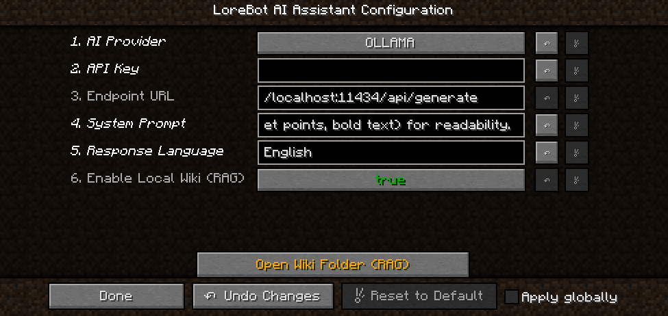

# LoreBot AI Assistant

A Minecraft Forge mod that integrates AI assistants directly into your game. Ask questions, get detailed answers, and enhance your gameplay with a local knowledge base (RAG) — all from the chat.

> **Current version:** 1.0.0
> **Minecraft:** 1.12.2
> **Forge:** 14.23.5.2859+
> **Future plans:** Support for NeoForge, Fabric, and newer Minecraft versions.

---

## Table of Contents

- [Features](#features)
- [Installation](#installation)
- [Configuration](#configuration)
- [AI Providers](#ai-providers)
- [Local Wiki (RAG)](#local-wiki-rag)
- [Usage](#usage)
- [License](#license)

---

## Features

- Ask questions to an AI directly from the Minecraft chat using `/ask`.
- Supports multiple AI providers: Ollama, OpenAI, Gemini, Claude, and Mistral.
- Built-in RAG (Retrieval-Augmented Generation) system with a local wiki folder.
- Fully configurable from the in-game Mod Config screen.
- Supports `.txt`, `.md`, `.pdf`, and `.docx` files for the local knowledge base.

---

## Installation

1. Install [Minecraft Forge](https://files.minecraftforge.net/net/minecraftforge/forge/index_1.12.2.html) for version **1.12.2**.
2. Download the latest `lorebot-x.x.jar` from the [Releases](../../releases) page.
3. Place the `.jar` file into your `.minecraft/mods/` folder.
4. Launch Minecraft and select the Forge 1.12.2 profile.

---

## Configuration

All settings are accessible from the in-game config screen:

1. Open Minecraft and go to **Mods**.
2. Find **LoreBot AI Assistant** in the mod list.
3. Click **Config**.



Below is a description of each setting:

### 1. AI Provider

Select which AI provider LoreBot will use to answer your questions.

| Provider | Type | API Key Required | Endpoint URL Required |
|----------|------|------------------|-----------------------|
| `OLLAMA` | Local | No | Yes (default: `http://localhost:11434/api/generate`) |
| `OPENAI` | Cloud | Yes | No |
| `GEMINI` | Cloud | Yes | No |
| `CLAUDE` | Cloud | Yes | No |
| `MISTRAL` | Cloud | Yes | No |

### 2. API Key

Your API key for the selected cloud provider. **Leave blank** if you are using Ollama or any other local LLM, since they don't require authentication.

- OpenAI: Get your key at [platform.openai.com](https://platform.openai.com/api-keys)
- Gemini: Get your key at [Google AI Studio](https://aistudio.google.com/app/apikey)
- Claude: Get your key at [console.anthropic.com](https://console.anthropic.com/)
- Mistral: Get your key at [console.mistral.ai](https://console.mistral.ai/)

### 3. Endpoint URL

The URL of the API endpoint. This field is **only relevant when using Ollama** (or any local OpenAI-compatible server). For cloud providers, the mod uses their official API endpoints automatically.

Default value: `http://localhost:11434/api/generate`

### 4. System Prompt

Base instructions that define how the AI behaves. A default prompt is already configured, but you can customize it to fit your needs — for example, making the AI respond in a specific tone, focus on certain topics, or role-play as a character.

### 5. Response Language

The language the AI should use when responding. This is a **free text field** — type the language yourself (e.g., `English`, `Spanish`, `Portuguese`, `Japanese`, etc.).

Default: `English`

### 6. Enable Local Wiki (RAG)

Enables or disables the local knowledge base. When enabled, LoreBot will search for relevant information in the `lorebot_wiki` folder before sending the question to the AI. See the [Local Wiki (RAG)](#local-wiki-rag) section for more details.

Default: `true`

---

## AI Providers

Each provider uses a specific model:

| Provider | Model | Notes |
|----------|-------|-------|
| **Ollama** | `llama3` | Runs locally. Requires [Ollama](https://ollama.com/) installed and running. |
| **OpenAI** | `gpt-3.5-turbo` | Requires an API key. |
| **Gemini** | `gemini-1.5-flash` | Requires a Google AI API key. |
| **Claude** | `claude-3-haiku-20240307` | Requires an Anthropic API key. |
| **Mistral** | `open-mistral-7b` | Requires a Mistral API key. |

### Using Ollama (Local AI)

1. Install Ollama from [ollama.com](https://ollama.com/).
2. Pull the required model: `ollama pull llama3`
3. Make sure Ollama is running before launching Minecraft.
4. In the mod config, set the provider to `OLLAMA` and keep the default endpoint URL.

> **Note:** Ollama runs entirely on your machine. No API key or internet connection is needed.

---

## Local Wiki (RAG)

LoreBot includes a simple RAG (Retrieval-Augmented Generation) system that lets you provide custom knowledge to the AI.

### How it works

1. When you ask a question with `/ask`, LoreBot first searches through documents in the `lorebot_wiki` folder.
2. The documents are split into small fragments and scored against your question using keyword matching.
3. The top 5 most relevant fragments are injected into the prompt as context.
4. The AI then uses this context to give you a more accurate and specific answer.

This means you can add guides, wikis, item lists, enchantment tables, or any information about your modpack, and LoreBot will use it to answer questions.

### Supported file formats

| Format | Extension |
|--------|-----------|
| Plain text | `.txt` |
| Markdown | `.md` |
| PDF | `.pdf` |
| Word document | `.docx` |

### Adding documents

The `lorebot_wiki` folder is located in your Minecraft game directory (next to the `mods` folder). You can also open it directly from the mod config screen by clicking the **"Open Wiki Folder (RAG)"** button.

Simply drop your files into the folder. LoreBot automatically indexes them and refreshes the index every 5 minutes.

### Tips for best results

- Use descriptive file names (e.g., `tinkers_construct_guide.txt`).
- Write clear, structured content — the AI works better with well-organized text.
- If you have a lot of information, split it into multiple files by topic.

---

## Usage

Once configured, use the `/ask` command in the Minecraft chat:

```
/ask How do I craft a backpack?
```

```
/ask What enchantments can I put on a sword?
```

LoreBot will display a response directly in the chat. The command is available to all players (no operator permissions required).

---

## License

This project includes Minecraft Forge MDK files which are distributed under their respective licenses. See [LICENSE.txt](LICENSE.txt) for details.
